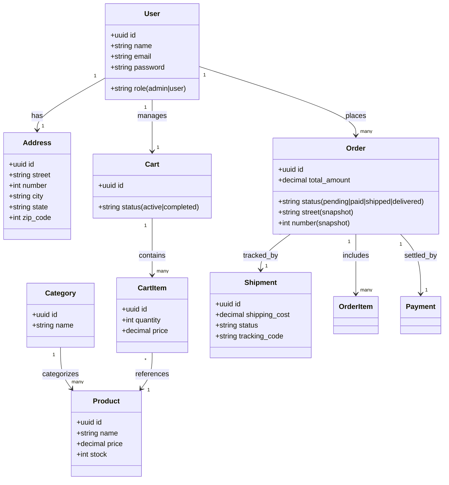

# E-Commerce Fullstack (Backend Laravel 11)

Este é um sistema de e-commerce robusto construído com Laravel 11, seguindo o padrão **Service Layer** e utilizando **UUIDs** para todos os modelos. O sistema conta com autenticação por tokens (Sanctum), gerenciamento de estoque, carrinhos persistentes, fluxo de checkout com snapshot de endereço, processamento de pagamentos simulado e sistema de envios (shipments).

## 🧩 Modelo de Domínio Atualizado



## 🚀 Como Rodar o Projeto

Siga os passos abaixo para configurar o ambiente local:

### 1. Requisitos
- PHP >= 8.2
- Composer
- SQLite (ou MySQL)

### 2. Instalação
```bash
# Clone o repositório
git clone https://github.com/Matheussmaced/e-commerce-fullstack.git
cd e-commerce-fullstack

# Instale as dependências
composer install

# Configure o ambiente
cp .env.example .env
php artisan key:generate

# No Windows (PowerShell), crie o banco SQLite se não existir
New-Item -ItemType File -Path database/database.sqlite -Force

# Execute as migrações
php artisan migrate

# Gere a documentação Swagger
php artisan l5-swagger:generate
```

### 3. Iniciando o Servidor
```bash
php artisan serve
```
Acesse a API em: `http://localhost:8000`

## 📖 Documentação da API

O projeto oferece duas formas de visualizar os endpoints:

1. **Swagger UI (Interativo)**: Acesse `http://localhost:8000/api/documentation`. Configure o token no botão **Authorize** após fazer login.
2. **API Guide (Estático)**: Abra o arquivo `docs/api-guide.html` no seu navegador para um guia de payloads e fluxos de frontend.

## 🛠️ Principais Recursos
- **Service Layer**: Toda a lógica de negócio está isolada em `app/Services`.
- **UUIDs**: Segurança e escalabilidade utilizando identificadores universais.
- **Address Snapshot**: Endereço de entrega é copiado para o pedido no checkout, garantindo histórico.
- **RBAC**: Middleware de proteção para rotas administrativas (`role: admin`).
- **Validation**: Respostas de erro padronizadas em JSON para todos os endpoints.

## 📦 Fluxo de Compra (Happy Path)
1. `POST /api/v1/register`: Cria conta.
2. `POST /api/v1/login`: Obtém Bearer Token.
3. `POST /api/v1/addresses`: Cadastra endereço de entrega.
4. `POST /api/v1/carts`: Inicia um carrinho.
5. `POST /api/v1/cart-items`: Adiciona produtos.
6. `POST /api/v1/checkout`: Finaliza e gera o Pedido (Order) + Envio (Shipment).
7. `POST /api/v1/payments`: Simula o pagamento.
8. `GET /api/v1/shipments/order/{id}`: Acompanha a entrega.
