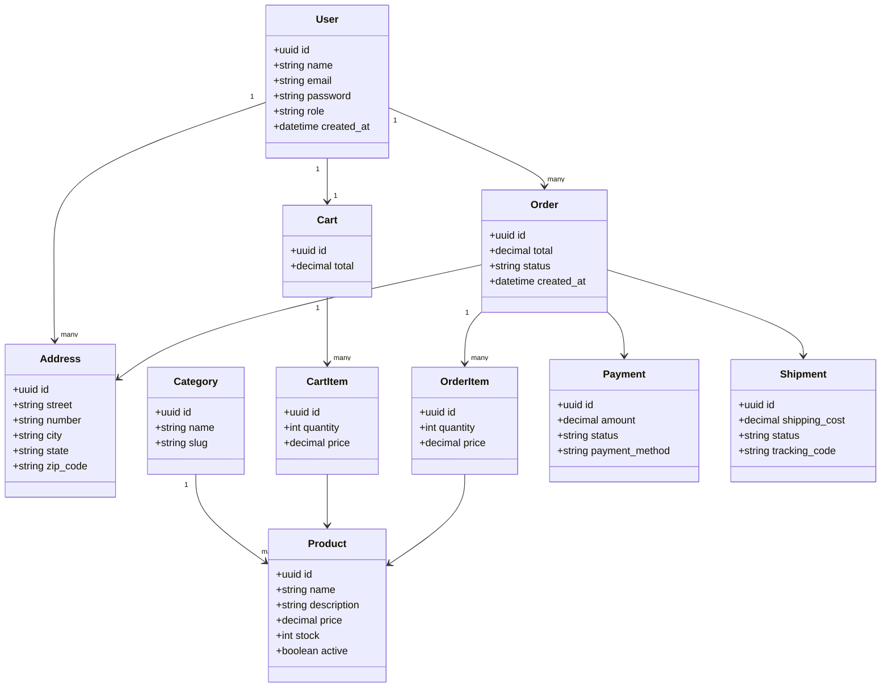

# diagrama-mini-ecommerce-laravel

## 🧩 Domain Model

```mermaid
classDiagram

class User {
  +uuid id
  +string name
  +string email
  +string password
  +string role
  +datetime created_at
}

class Address {
  +uuid id
  +string street
  +string number
  +string city
  +string state
  +string zip_code
}

class Product {
  +uuid id
  +string name
  +string description
  +decimal price
  +int stock
  +boolean active
}

class Category {
  +uuid id
  +string name
  +string slug
}

class Cart {
  +uuid id
  +decimal total
}

class CartItem {
  +uuid id
  +int quantity
  +decimal price
}

class Order {
  +uuid id
  +decimal total
  +string status
  +datetime created_at
}

class OrderItem {
  +uuid id
  +int quantity
  +decimal price
}

class Payment {
  +uuid id
  +decimal amount
  +string status
  +string payment_method
}

class Shipment {
  +uuid id
  +decimal shipping_cost
  +string status
  +string tracking_code
}

User "1" --> "many" Address
User "1" --> "1" Cart
User "1" --> "many" Order

Category "1" --> "many" Product

Cart "1" --> "many" CartItem
CartItem --> Product

Order "1" --> "many" OrderItem
OrderItem --> Product

Order --> Payment
Order --> Shipment
Order --> Address 
```
